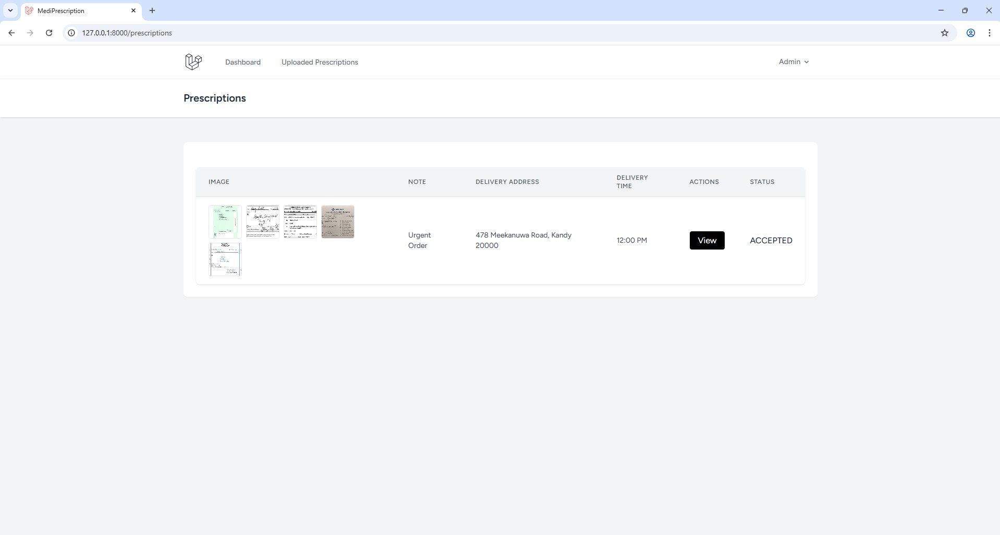

##  Project Overview

##  Features Implemented

- Prescription upload and management
- Medicine assignment and price calculation
- Quotation submission and acceptance/rejection workflow
- Enum-based prescription status: `PENDING`, `SUBMITTED`, `ACCEPTED`, `REJECTED`
- Admin and user roles with appropriate access control
- Dynamic UI to view, zoom, and switch prescription images
- Backend validation and clean code structure

---

##  Backend Login Details

- **Admin Email:** `admin@email.com`  
- **Admin Password:** `123456789`

---

##  Setup Instructions

1. **Clone or extract the zipped folder**
2. **Navigate to the project root**
3. **Install dependencies**
   ```bash
   composer install
   npm install && npm run dev
   php artisan serve

<p align="center">
  
  
  
  
  
  
  
  
  
</p>
